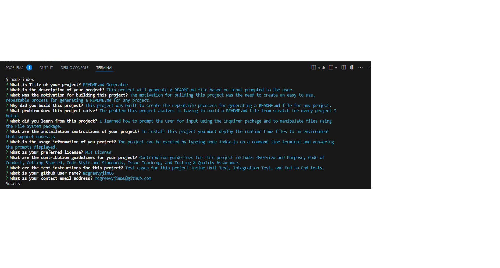
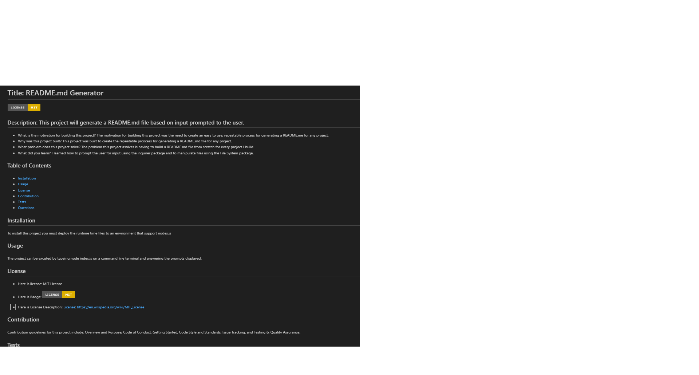

# Readme-Generator

## Description

When creating an open source project on GitHub, it’s important to have a high-quality README for the app. This should include what the app is for, how to use the app, how to install it, how to report issues, and how to make contributions.

This command line app will quickly and easily create a README file by using a command-line application to generate one. This allows the project creator to devote more time to working on the project.

This app will create a command-line application that dynamically generates a professional README.md file from a user's input using the [Inquirer package](https://www.npmjs.com/package/inquirer/v/8.2.4).

## Usage

To view a demo of this application, please view to demo located at https://watch.screencastify.com/v/PaCxEikDKJMDO4FIhO1M 

## Source

My repo, is located at <https://github.com/mcgreevyjim66/Readme-Generator>.
There is source code located in the Readme-Generator folder.

## Mock-up

## Credits

Author: Jim McGreevy
Date:   8/30/2023

